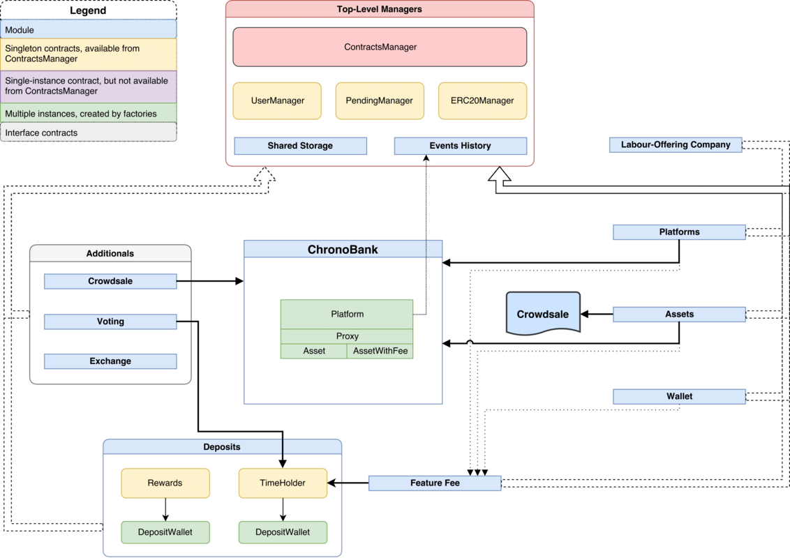
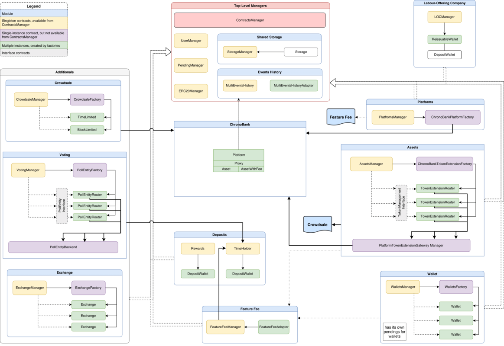

# ChronoBank Smart Contracts [](https://travis-ci.org/ChronoBank/SmartContracts)

## Overview

_ChronoBank Smart Contracts_ ecosystem is built around two things simple for understanding: platforms and assets.

_ChronoBank platforms_ act as a base for all token operations (like issuing, balance storage, transfer) and embodied in ChronoBankPlatform contact.

_ChronoBank assets_ (instances of _ChronoBankAsset_ contract) add interface layout and define some custom internal logic to allow implementing different behavior, for example, adding a fee to token transactions (look at _ChronoBankAssetWithFee_ contract).

Since assets define just internal behavior, there are so-called _ChronoBank_ asset proxies (see _ChronoBankAssetProxy_ contract) which provide an _ERC20 standard_ interface (described in **ERC20Interface.sol**) and acts as a transaction proxy. It allows to add/change token logic by updating asset implementation and to recover a wallet access in case of key loss.

While looking into details it could be spotted that _ChronoBank Smart Contracts_ ecosystem is more than just platforms and assets. These core entities represent important but small part of all functionality.


## Ecosystem

The next foundational block in the ecosystem is a top-level contracts module (a handful of managers) that provides all needed interfaces to organize flexible and powerful tools.

[](./misc/Smart_Contracts_small_v6-1.png) [PDF version](./misc/Smart_Contracts_small_v6-1.pdf) for detailed preview.

**ContractsManager** plays a role in the central registry which holds references to all services registered in a system.

To get to the central registry contracts should be added by a contract owner of **ContractsManager** or those contacts that are allowed to do so (based on ACL in **StorageManger**).

It's worth mentioning that a set of managers (top-level and others) do not store their data directly in storage, but use instead **Storage** contract to pass responsibility for saving data. This **Storage** contracts besides **StorageManager** are included in Shared Storage set of contracts.

**UserManager** contract which role is to provide system-wide user registry where simple users and admins (_CBE_) live together. It also provides a part of multisignature infrastructure by keeping a number of admins required to confirm operations.

**PendingManager** contract which provides the rest of _multisignature_ functionality by holding and tracking operations performed in a system and carrying them out when a critical number of confirmations were received.

**ERC20Manager** contract which keeps track of all ERC20-based tokens registered in a system.

**Events History** is a submodule which performs like a gate for all events happen in a system. All system managers are using the same instance of _EventsHistory_ (see **MultiEventsHistory** contract), other contracts created during the system's work could use different event histories instances.

_Labour-Offering Companies_ (**LOCManager**) is a particular module that organizes work of _ChronoBank_ with third-party companies and allows them to participate in the _ChronoBank_ ecosystem (read the Whitepaper for more details).

The next part of modules is designed to make users' life easier by providing additional layers of abstraction on top of existing core contracts.

### Key contracts

#### PlatformsManager

The key contract is **PlatformsManager** that makes it possible to manipulate multiple _ChronoBank_ platforms and create brand new platforms.

#### AssetsManager
The key contract is AssetsManager that allows users to build their own tokens, organize their crowdsale.

#### WalletManager
The key contract is WalletManager that give the ability to create wallets for storing tokens and organize multisignature access to its balance and transfers (it's important to note that multisignature mechanism is independently implemented and isn't based on PendingManager contract).

#### Other
Besides aforementioned modules there are also modules that manipulate tokens (_TIME_ and other _ERC20_) tokens) to allow to:
- unlock system's functionality for usage where it is needed to stake some amount of tokens to perform an operation;
- get rewards for some period of time-based on a number of tokens user had deposited;
- pay for unique functionality available in a system (such as creating a new platform, issuing a token, starting a token _crowdsale_, creating a _wallet_ and some others).

For providing such ability for a system, there were introduced a couple of contracts that are coupled with _Deposit_ and _Feature Fee_ modules. _Deposit_ module includes:
- **Reward** contract that is responsible for tracking, calculating and withdrawing rewards for token holders (in case of _ChronoBank_ it is TIME tokens).
- **TimeHolder** keeps track of tokens stacked by users to unlock system's functionalities Feature Fee module organizes an instrument for signing system's functions as payable by system tokens (in case of _ChronoBank_ it is _TIME_ tokens).

Last but not least is Additionals modules that provided extended functionalities for _ChronoBank_ ecosystem:

**Crowdsale** - the key contract is **CrowdsaleManager** and it organizes token _crowdsale_. It was made available to use only through **AssetsManager**.

**Voting** - the key contract is VotingManager which arranges poll creation where users that hold their _TIME_ tokens in **TimeHolder** could vote to participate in system's decisions.

**Exchange** - the key contract is **ExchangeManager** which coordinates exchanges between different tokens and allows users to sell/buy tokens for other tokens.

A more detailed version of the scheme contains internal entities and connections that participate in module's work.

## Dive in!

As were said _ChronoBank_ ecosystem has its own token called TIME that fuels work of many functions. We gather them in one place to provide a more specific overview of their responsibilities.

[](./misc/Smart_Contracts_full_v6-1.png) [PDF version](./misc/Smart_Contracts_full_v6-1.pdf) for detailed preview.

#### TimeHolder
Main contracts:
 - _timeholder/TimeHolder.sol_

(newer version is under construction with support of using multiple ERC20 tokens as shares)

Deposit holder. Allows to deposit/withdraw _TIME_ tokens. Users, who have deposits, are allowed to use some key features of the system such as creating _ERC20_ tokens, starting crowdsale for it, create exchanges and so forth.

Users could deposit and withdraw at any time and those changes will appropriately update functionalities that are bound to **TimeHolder** (such as voting and so forth).

_Dev notes_: New functionalities and new contracts could take advantage of using TimeHolder’s shares to secure and restrict their features: developers are able to add new contracts and use ListenerInterface to observe changes in TimeHolder’s deposits - this will unlock an access to notifications about deposit/withdrawal actions made by the user.

#### PollManager (VotingManager.sol is under construction)
Main contracts:
 - _vote/PollManager.sol_.

 This piece of functionality takes place in the system and is responsible for voting functions. It serves as a central point to enter and manipulate (create, navigate, stop) polls.

 In general, it aggregates the next functions:
 - creation of new polls,
 - tracking the number of currently active polls,
 - getting paginated lists of all created polls.

 Users, who have _TIME_ deposits, allowed to perform a vote connected actions according to _TIME_ deposit value.

#### ExchangeManager
Main contracts:
 - _exchange/ExchangeManager.sol_.

It’s an exchange registry that holds information about created exchanges and provides some utility methods for managing them.

It serves as the entry point for creating new exchanges.

Standalone **Exchange** allows users to buy/sell assigned _ERC20_ token for ether, as long as there is available supply.

Contract owner maintains sufficient token and ether supply, and sets buy/sell prices. In order to be able to sell tokens, the user needs to create an allowance for this contract, using standard _ERC20_ _approve()_ function, so that an exchange could take tokens from the user when the user orders a sell.

_CBE_ users are permitted to manage fee value against which an exchange will calculate the fee.

Some methods might take a fee in _TIME_ tokens.

_Some methods might take a fee in TIME tokens._

|Function|Description|Price|
|--|--|--|
|createExchange|Creates a new exchange with the given params.|TBD|


#### PlatformsManager
Main contracts:
 - _assets/PlatformsManager.sol_.

Managing system’s and users’ platforms is possible because of this contract. It allows to create and manipulate platforms and considered as an entry point to go through user’s platforms.

Provides system-wide ability to manage user's platforms. This contract allows to:
- create a brand new platform,
- get a list of platforms owned by a user,
- attach (or detach) any platforms outside the system or created somewhere by users themselves.

Some methods could require paying additional fee in _TIME_ tokens during their invocation

_Some methods could require to pay additional fee in TIME tokens during their invocation_

|Function|Description|Price|
|--|--|--|
|createPlatform|Creates a brand new platform|TBD|

#### PlatformTokenExtensionGatewayManager
Main contracts:
 - _assets/extensions/PlatformTokenExtensionGatewayManager.sol_

That is a backend contract specifically created to aggregate main functionality for token manipulations and make less burden on a token creation process as well as on other functions.

Key responsibilities are to:
- create assets (with and without fee),
- create token crowdsale and remove them.

_Some methods might take a fee in TIME tokens._

_Dev notes:_ Since this contract is designed to be used by _delegatecall_ it doesn't inherit from any contract (except FeatureFeeAdapter) and you should be careful when a need will arise to add more functionality by inheritance because the contract uses storage layout from TokenExtensionRouter and it should be preserved.

|Function|Description|Price|
|--|--|--|
|createAssetWithoutFee|Creates asset without fee. Performs asset registration in ERC20Manager. Allowed to be performed only from _delegatecall_ and only by platform owner.|TBD|
|createAssetWithFee|Creates asset with fee. Performs asset registration in ERC20Manager. Allowed to be performed only from _delegatecall_ and only by platform owner.|TBD|
|createCrowdsaleCampaign|Creates crowdsale campaign of a token with provided symbol|TBD|

#### Wallet
Main contracts:
- _wallet/WalletsManager.sol_,
- _wallet/Wallet.sol_.

Allows to manage multisignature wallets, i.e.
- create wallet,
- add wallet,
- remove wallet.

(is under construction)

| Function | Description | Price |
| -- | -- | -- |
| createWallet() | Creates multisignature wallet with given params. | TBD |

## Documentation

For more details please refer to [chronobank.github.io](https://chronobank.github.io/SmartContracts/).

## Testing
Tests are included and can be run using truffle.

NodeJS 8+ required.

```bash
npm install
export NODE_OPTIONS="--max_old_space_size=4096"
export PATH=$PATH:$(pwd)/node_modules/.bin
```

Then start TestRPC in a separate terminal by doing
```bash
testrpc
```

Then run tests in a project dir by doing
```bash
truffle test
